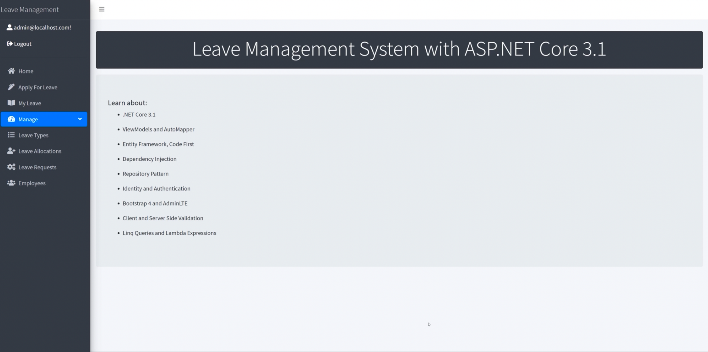

# Leave Management System
A fullstack .NET 6 application, with the concept of a management system for the HR department of a fictional company.

    

# Purpose
The purpose of the project is to demonstrate an implementation example of Clean/Onion architecture, CQRS structure and using Mediator Pattern on the back-end. It points out best practices and decisions made early in the process which have a large impact on maintainability and testability in the long run. It closely adheres to the SOLID principles, was constructed with an agile development method.

# Technical and architectural features
* Based on Clean/Onion Architecture
* Structured using Command Query Responsibility Segregation (CQRS)
* Implemented with Mediatr Pattern
* Email Service coded using SendGrid
* Efficient Exception Handling and Routing
* Includes Unit Testing
* Moq and Shouldy libraries for testing
* Global Error Handling with Custom Middleware and Exceptions
* Adding Validation using Fluent Validation
* Built with .NET Core API and MVC UI Application
* Implemented with JWT(JSON Web Token) Authentication

# References
> The complete course can be found here [page](https://www.udemy.com/course/aspnet-core-solid-and-clean-architecture-net-5-and-up).